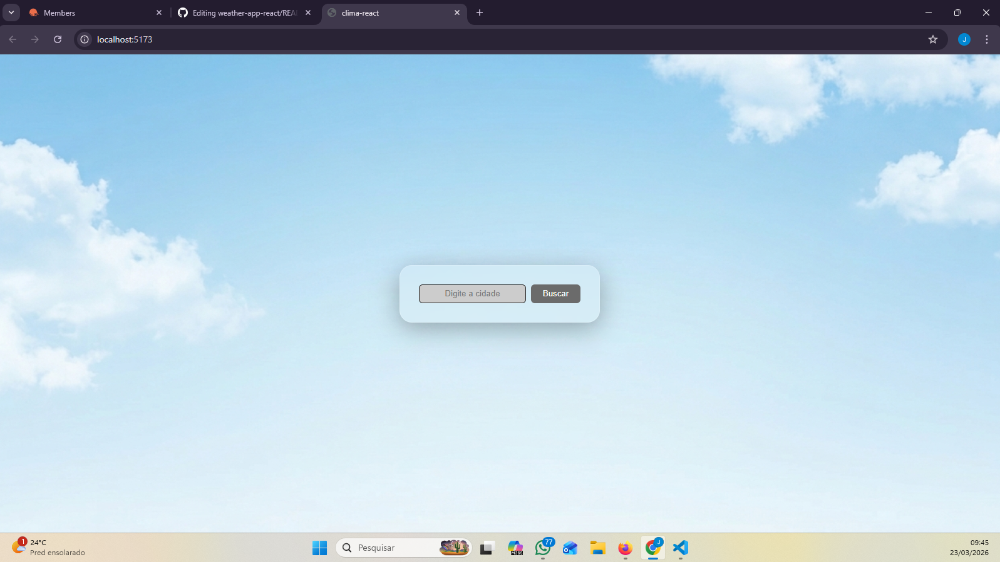
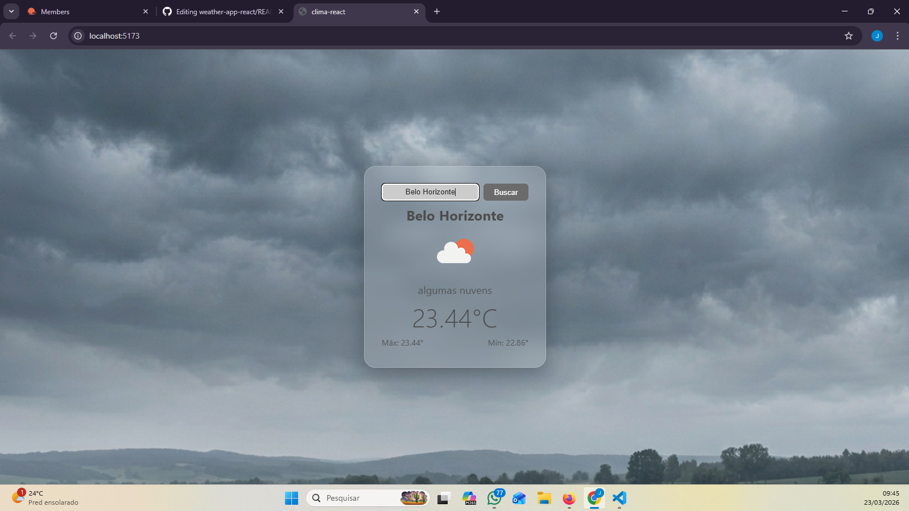

# 🌤️ Weather App (React)

Aplicação web que consome a API da OpenWeather para exibir informações climáticas em tempo real.

## 🚀 Funcionalidades
- Busca de cidade
- Temperatura atual
- Máxima e mínima
- Ícone do clima
- Fundo dinâmico conforme clima
- Loading e tratamento de erro

## 🛠️ Tecnologias
- React
- JavaScript
- CSS
- API REST (OpenWeather)

## 📸 Preview

### Tela inicial


### Resultado da busca


## ▶️ Como rodar
```bash
npm install
npm run dev
